<h1 align="center">battle-band</h1>

<p align="center"><b>The first idle-RPG in your Claude Code.</b></p>

<p align="center">
  A pixel-art knight fights above the prompt of the Claude desktop app while Claude works.<br>
  When Claude rests, he sleeps by a campfire. Your usage limits are the roads he walks.
</p>

<p align="center">
  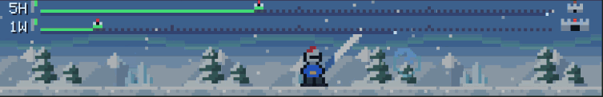
  <br><sub>Recorded from the real app (the Yeti King).</sub>
</p>

<p align="center">
  <a href="#try-it-in-30-seconds"><b>Try it in 30 seconds</b></a> &nbsp;·&nbsp;
  <a href="docs/media/tour.mp4?raw=true">Tour video (93 s)</a> &nbsp;·&nbsp;
  <a href="README.vi.md">Tiếng Việt</a>
</p>

---

An idle-RPG plays itself while you do something else. This one plays itself while **Claude** does something else.
Next time Claude takes a minute, you get a tiny adventure to glance at.

- **It plays itself.** Four worlds, twelve monsters, four bosses. Dash strikes, damage numbers, and boss attacks that show a warning mark before they land.
- **It never ends.** After the volcano the knight walks back into the dungeon and every monster returns in new colors, one round tougher.
- **It rests when Claude does.** A campfire, drifting embers and one very sleepy knight.
- **Your usage limits are the roads.** Two little roads draw your 5-hour (**5H**) and weekly (**1W**) limits, green then amber then red. Reach the end of a road and you are out of tokens.
- **Free to run.** Nothing to click, nothing to configure, and it never talks to the model, so it spends no tokens.

<p align="center">
  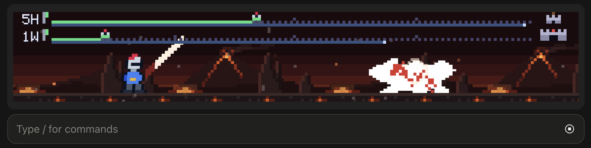
  <br><sub>A real screenshot: the band sits right above the prompt.</sub>
</p>

## Try it in 30 seconds

```bash
git clone https://github.com/gianggenius/battle-band.git
cd battle-band && ./install.sh
```

Then open a **new session** in the Code tab of the Claude desktop app. That is all. Remove it any time with `./install.sh --uninstall`.

<details>
<summary>Other ways to install (no script, Windows, marketplace, development)</summary>

- **No script:** copy the `plugin` folder to `~/.claude/skills/battle-band` (Windows: `%USERPROFILE%\.claude\skills\battle-band`, untested), then start a new session.
- **Update:** `git pull && ./install.sh`, then start a new session.
- **Plugin marketplace (Claude Code CLI):** `claude plugin marketplace add gianggenius/battle-band`, then `claude plugin install battle-band@battle-band`.
- **Any folder, for development:** point `CLAUDE_CODE_PLUGIN_DIRS` at the `plugin` folder in the `env` block of `~/.claude/settings.json`. Use only one way at a time, or you get two bands.

`install.sh` only copies `plugin/` to `~/.claude/skills/battle-band`, where the engine loads it as `battle-band@skills-dir`. It edits no setting, validates the copy when it can find a Claude engine, and warns if your settings already load battle-band another way.

All three routes were checked headless with the app's own engine in a clean home folder (`hooks module battle-band@... loaded`, `tier user`). Only the `CLAUDE_CODE_PLUGIN_DIRS` route has also run in the real desktop app.

</details>

## A closer look

### Four worlds, four bosses

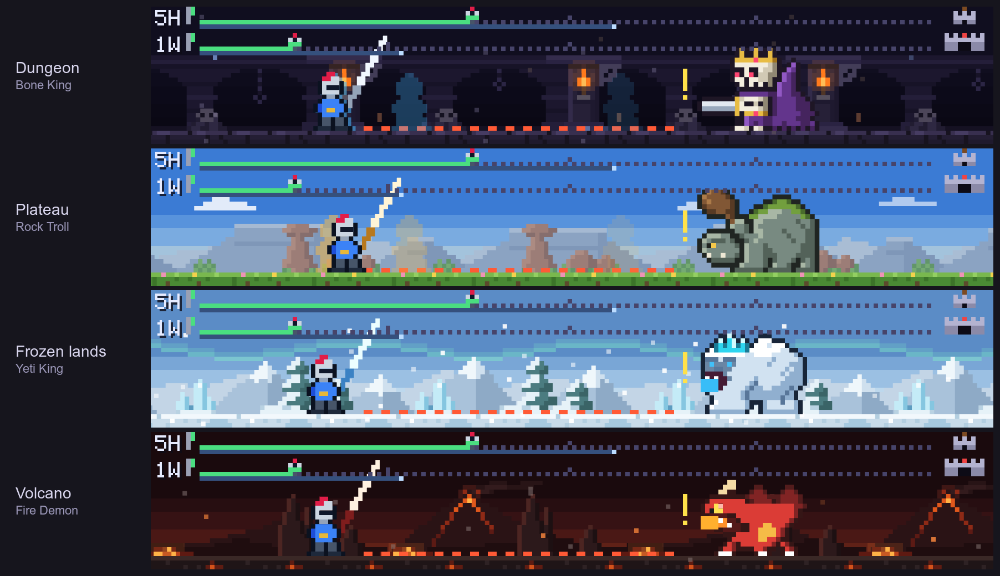

| World | Monsters | Boss |
|---|---|---|
| Dungeon | Green Slime, Skeleton Warrior, Cave Bat | Bone King |
| Plateau | Scout Goblin, Wild Boar, Vulture | Rock Troll |
| Frozen lands | Ice Slime, Snow Wolf, Snow Spirit | Yeti King |
| Volcano | Lava Slime, Imp, Ember Bat | Fire Demon |

The "!" and the red line are a boss's warning: its big attack lands a moment later, and the knight dodges or blocks it.

### It never ends

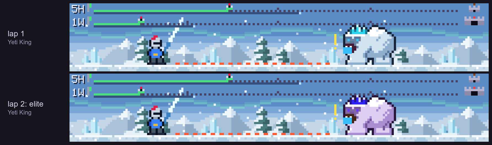

Lap 2 and every lap after: the same places and monsters in new colors, one round tougher.

### Your usage limits, as roads

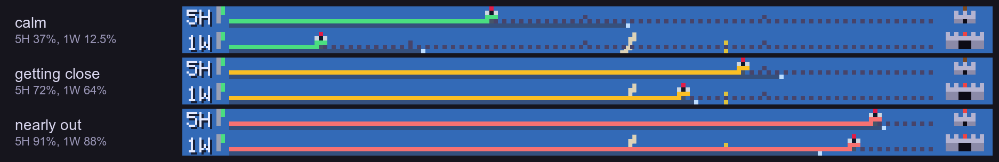

A little knight walks the 5H road to the tower and the 1W road to the castle as the limits fill. The steel bar under each road is the time that has passed in that window, so you can see whether you are going faster than the clock. Hover a road for the exact numbers.

### Camp

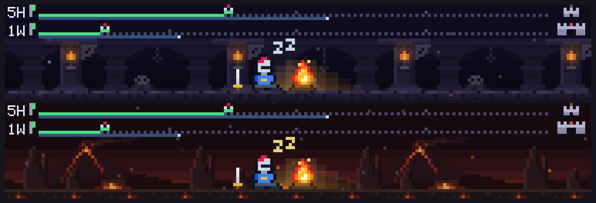

When Claude is idle, the knight sleeps by the fire in whichever world he last reached.

<details>
<summary>More pictures and the full tour</summary>

<p align="center">
  <a href="docs/media/tour.mp4?raw=true">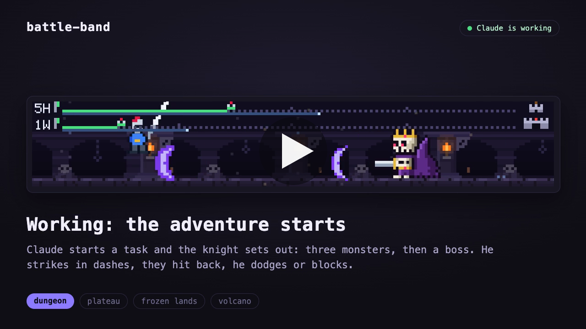</a>
  <br><sub>A captioned tour of 93 s (mp4, 5 MB, click the picture to download). A screen recording of the real app, 100 s: <a href="docs/media/in-app-recording.mp4?raw=true">in-app-recording.mp4</a>.</sub>
</p>

Each picture is one world: a fight, the boss's warning and the boss's end.

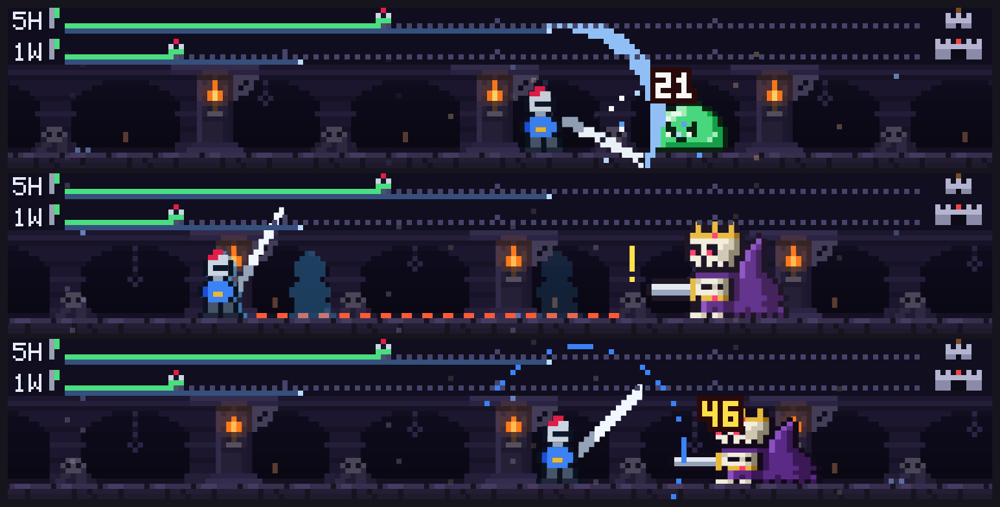

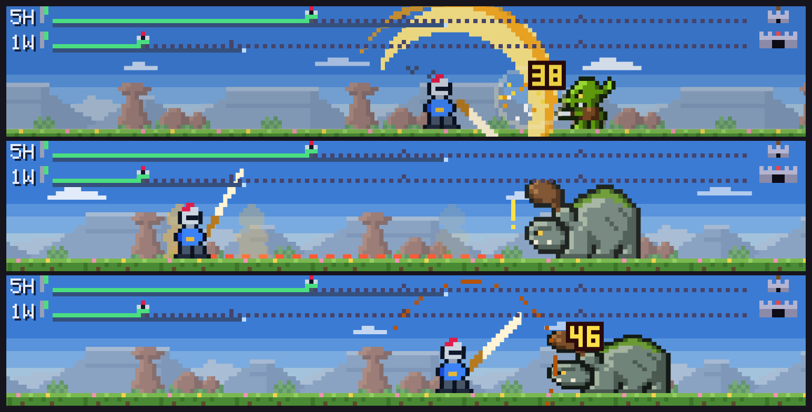

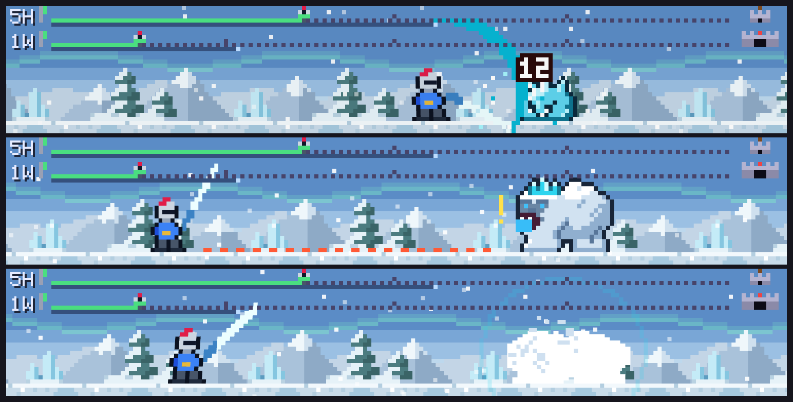

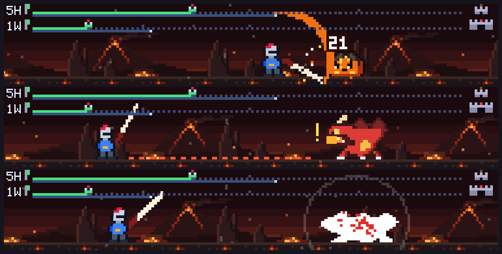

All four camps:

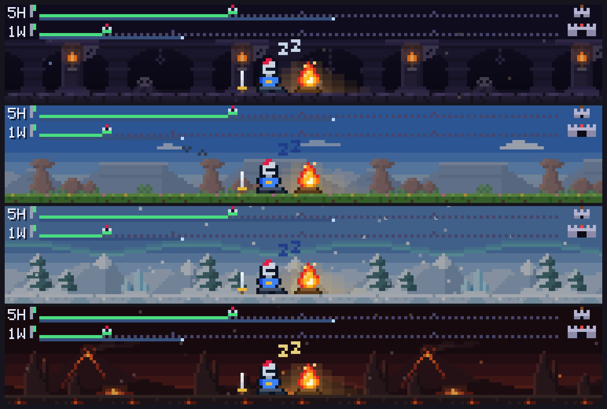

Three bosses in lap 1 and in their elite colors in lap 2:

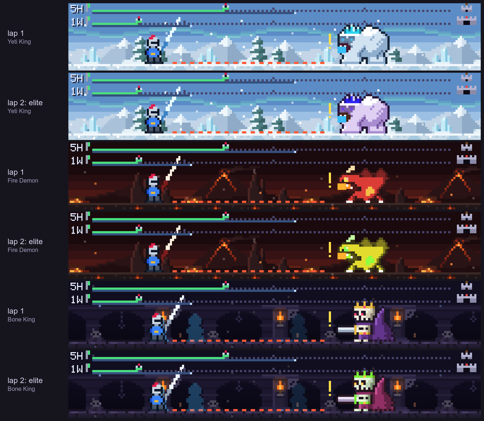

All six states of the usage strip:

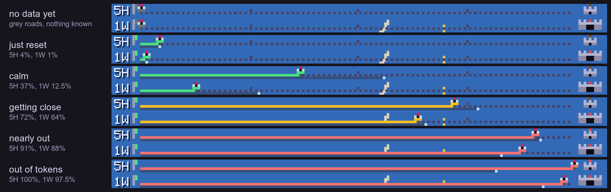

</details>

## Good to know

- **Desktop app only.** Nothing is drawn in the terminal or in VS Code. Tested on macOS 26.6 with Claude desktop 2.19675.0 (engine 2.1.286); Windows should work but is untested.
- **The knight only moves while Claude works.** Each new session starts in the dungeon, and the next stretch of work continues where the last one stopped.
- **Every 48 seconds the band dims for about a second**, while the knight walks into the next world. In a 100 s recording of the real app those were the only dark moments, apart from one short restart as the recording began.
- **It is an idle game in the watch-it-go sense:** no stats, loot or levels, just the adventure.
- **The hover text on the usage roads is in Vietnamese** for now (`plugin/hooks/adv/usage.ts` has the strings if you want to translate them).
- **The roads stay grey** until the engine reports your limits (after the first answer of a session), or for good if your account has no 5-hour or weekly window.
- **Cost:** in a software-rendered test it used about 8 to 11% of one CPU core. Its cost inside the app was not measured.
- The engine's plugin hooks are new, so a future update may change them: run `claude plugin validate` if the band stops showing.

## How it works

- The mod answers the app's `ui.render` hook (the band above the prompt) with one animated SVG: pure SMIL, no scripts. Three tiny hooks, `turn.start`, `turn.complete` and `session.measure`, tell it when Claude works and what your usage is.
- The app rebuilds the picture whenever the mod redraws it, so the picture is a function of the clock: each redraw says where in the 48 s lap the knight is, and the animation carries on from there.
- Design notes, including the app's drawing path and the limits found along the way (in Vietnamese): [docs/design.md](docs/design.md).

## Safe by design

- It reads when a turn starts and ends, and your usage numbers (percent used and reset time). It never reads your prompts or the answers.
- No network, no files, no commands, no tools, no MCP servers. `claude plugin validate plugin` lists the few engine calls the code makes: `$.clock.after`, `$.clock.now`, `$.session.usage`, `$.ui.invalidate`, `$.ui.resolve`.
- The picture is cleaned by the app and shown in a sandboxed frame without scripts or network access.
- About 3,000 lines of TypeScript and no dependencies: small enough to read before you install. The whole mod is the `plugin` folder.

## Hack on it

Monsters and worlds are small text sprites (`plugin/hooks/adv/art/`, `plugin/hooks/adv/biomes/`), so adding your own is easy to try. Ideas and pull requests are welcome.

<details>
<summary>Layout, commands and rebuilding the media</summary>

```
plugin/               the mod, the only folder that gets installed
  .claude-plugin/       plugin.json
  hooks/                hooks.json and register.tsx (the hooks and the draw)
  hooks/adv/            the art (sprites, worlds), the choreography, the usage strip, the camp
  tests/                12 tests, run by `claude plugin test`
tools/                build, check and deploy scripts
tools/host/           replays the app's drawing of an Svg (its scrub and sandboxed frame) in headless Chrome
tools/media/          rebuilds the pictures and the tour video in docs/media
docs/design.md        design notes (Vietnamese)
install.sh            the installer
.claude-plugin/       marketplace.json
```

`claude` below is the engine. If you have only the desktop app, use the one it downloaded: `~/Library/Application Support/Claude/claude-code/<version>/<id>/claude.app/Contents/MacOS/claude`.

```bash
claude plugin validate plugin --strict     # manifest, hooks, and the engine calls the code makes
claude plugin test plugin                  # the 12 tests (a fake clock drives them)
bun tools/build.ts out all                 # one SVG per world, into ./out
(cd tools/host && npm install)             # once: puppeteer-core and DOMPurify
node tools/host/sanitize-check.js out/*.svg   # what the app's scrub would drop (it must drop nothing)
```

To work on the mod, point `CLAUDE_CODE_PLUGIN_DIRS` at your working copy's `plugin` folder (instead of running `install.sh`), start a session, and run `/reload-plugins` after each change. `tools/deploy.sh` is the author's way to ship to such a folder: it validates and tests a clean copy, builds every picture through the scrub, backs up the old copy and copies the new one.

The pictures and the video in `docs/media` come from `tools/media/make-media.sh` (needs bun, Chrome, ffmpeg and ImageMagick), except `hero.gif`, `in-app.png` and `in-app-recording.mp4`, which are captures of the real app.

</details>

## License

[MIT](LICENSE). Built by GiGi together with Claude Code. An unofficial community mod: it is not made, endorsed or supported by Anthropic. Claude is a trademark of Anthropic.
