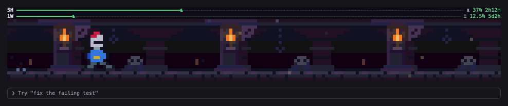
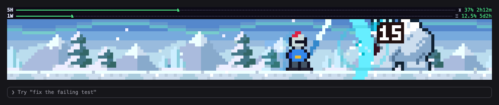
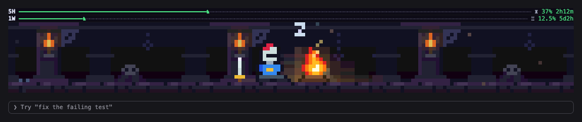

<h1 align="center">battle-band</h1>

<p align="center"><b>Game idle-RPG đầu tiên trong Claude Code của bạn.</b></p>

<p align="center">
  Một hiệp sĩ pixel-art chiến đấu phía trên ô nhập khi Claude làm việc, trong app Claude desktop và trong terminal.<br>
  Khi Claude nghỉ, anh ngủ bên đống lửa trại. Giới hạn usage của bạn là những con đường anh đang đi.
</p>

<p align="center">
  
  <br><sub>Quay từ app thật (Vua Yeti).</sub>
</p>

<p align="center">
  <a href="#thử-trong-30-giây"><b>Thử trong 30 giây</b></a> &nbsp;·&nbsp;
  <a href="docs/media/tour.mp4?raw=true">Video giới thiệu (93 giây)</a> &nbsp;·&nbsp;
  <a href="README.md">English</a>
</p>

---

Idle-RPG là game tự chơi trong lúc bạn làm việc khác. Game này tự chơi trong lúc **Claude** làm việc.
Lần tới Claude mất một phút, bạn có một cuộc phiêu lưu nhỏ để liếc xem.

- **Tự chơi.** Bốn thế giới, mười hai quái, bốn boss. Lao tới chém, số sát thương nhảy lên, và đòn lớn của boss luôn có dấu cảnh báo trước khi giáng xuống.
- **Không bao giờ hết.** Sau núi lửa, hiệp sĩ quay lại hầm ngục và mọi quái trở lại với màu mới, mạnh hơn một hiệp.
- **Nghỉ khi Claude nghỉ.** Đống lửa trại, tàn lửa bay lên và một hiệp sĩ đang ngủ gật.
- **Desktop và terminal.** Cùng một cuộc phiêu lưu phía trên ô nhập của app Claude desktop và của Claude Code trong terminal.
- **Giới hạn usage của bạn là những con đường.** Hai con đường nhỏ vẽ giới hạn 5 giờ (**5H**) và giới hạn tuần (**1W**), xanh rồi vàng rồi đỏ. Tới cuối đường là hết token.
- **Chạy miễn phí.** Không có gì để bấm, không có gì để cấu hình, và mod không bao giờ nói chuyện với model nên không tốn token.

<p align="center">
  
  <br><sub>Ảnh chụp thật: band nằm ngay trên ô nhập.</sub>
</p>

## Thử trong 30 giây

**Trong app Claude desktop**, không cần terminal:

1. Bấm **+** cạnh ô nhập, chọn **Plugins**, rồi **Add plugin**.
2. Trong trình duyệt plugin chọn **Add marketplace**, nhập `gianggenius/battle-band` rồi xác nhận.
3. Mở **battle-band** và cài cho tài khoản của bạn.
4. Mở **phiên mới** trong tab Code. Band hiện ngay phía trên ô nhập.

App sẽ clone repo nên máy cần có Git. Nếu không thấy **Add marketplace**, hoặc app báo bị chặn, tổ chức của bạn đã tắt tính năng này: dùng terminal hoặc cách từ bản tải về ở dưới.

**Trong Claude Code ở terminal:**

```bash
claude plugin marketplace add gianggenius/battle-band
claude plugin install battle-band@battle-band
```

Rồi mở phiên mới. Terminal và app desktop dùng chung cấu hình plugin, nên cài một lần là band hiện ở cả hai.

<details>
<summary>Các cách cài, cập nhật và gỡ khác (bản tải về, phát triển)</summary>

- **Từ bản tải về, không dùng marketplace:**
  ```bash
  git clone https://github.com/gianggenius/battle-band.git
  cd battle-band && ./install.sh
  ```
  `install.sh` chỉ chép `plugin/` vào `~/.claude/skills/battle-band`, nơi engine nạp nó thành `battle-band@skills-dir`. Script không sửa setting nào, kiểm tra bản chép khi tìm thấy engine Claude, và cảnh báo nếu setting của bạn đã nạp battle-band bằng cách khác. Không dùng script thì tự chép thư mục `plugin` vào đó (Windows: `%USERPROFILE%\.claude\skills\battle-band`, chưa thử).
- **Thư mục bất kỳ, để phát triển:** đặt `CLAUDE_CODE_PLUGIN_DIRS` trỏ tới thư mục `plugin` trong khối `env` của `~/.claude/settings.json`.
- **Cập nhật:** `claude plugin update battle-band@battle-band`, hoặc từ bản tải về `git pull && ./install.sh`. Rồi mở phiên mới.
- **Gỡ:** app desktop **+** > **Plugins** > **Manage plugins**; terminal `claude plugin uninstall battle-band@battle-band`; bản tải về `./install.sh --uninstall`.

Mỗi lần chỉ dùng một cách, nếu không bạn sẽ có hai band.

Cách đã kiểm: nút **Add marketplace** của app desktop chạy đúng lệnh `claude plugin marketplace add` của engine. Lệnh đó, bước cài và bước nạp đã được kiểm từ GitHub bằng engine của app trong một thư mục home sạch (`hooks module battle-band@... loaded`, `tier user`); cách bản tải về và `CLAUDE_CODE_PLUGIN_DIRS` cũng kiểm như vậy. Chỉ `CLAUDE_CODE_PLUGIN_DIRS` đã chạy cả trong app desktop thật, còn band terminal đã chạy trong Claude Code 2.1.289 thật (nạp bằng `--plugin-dir`). Tên các menu ở trên lấy từ app và tài liệu của nó; chưa ai bấm thử từng bước, nếu tên khác thì bạn mở issue giúp.

</details>

## Nhìn kỹ hơn

### Bốn thế giới, bốn boss


| Thế giới | Quái | Boss |
|---|---|---|
| Hầm ngục | Slime lục, Chiến binh xương, Dơi hang | Vua Xương |
| Cao nguyên | Goblin do thám, Lợn rừng, Kền kền | Troll đá |
| Vùng băng giá | Slime băng, Sói tuyết, Tinh linh tuyết | Vua Yeti |
| Núi lửa | Slime dung nham, Tiểu quỷ, Dơi than hồng | Quỷ lửa |

Dấu "!" và đường đỏ là cảnh báo của boss: đòn lớn giáng xuống ngay sau đó, hiệp sĩ né hoặc đỡ.

### Không bao giờ hết


Vòng 2 và mọi vòng sau: cùng thế giới và quái, màu mới, mạnh hơn một hiệp.

### Giới hạn usage của bạn, thành những con đường


Một hiệp sĩ nhỏ đi trên đường 5H tới cái tháp và trên đường 1W tới lâu đài khi giới hạn đầy dần. Thanh thép dưới mỗi đường là thời gian đã trôi của cửa sổ đó, để bạn thấy mình đang đi nhanh hơn đồng hồ hay không. Rê chuột lên một đường để xem số chính xác.

### Trại


Khi Claude rảnh, hiệp sĩ ngủ bên đống lửa ở thế giới anh vừa tới.

### Trong terminal



Hai đường usage thành hai dòng chữ, còn cảnh là một lưới ô, mỗi ô hai điểm ảnh (ký tự nửa khối `▀`), được vẽ lại tại chỗ khoảng 12 lần một giây khi anh chiến đấu. Cửa sổ từ 126 cột trở lên thấy đủ từng điểm ảnh (rộng hơn thì cắt quanh vùng hành động, tối đa 190 cột); hẹp hơn thì thu nhỏ, và chỗ trống dưới 8 dòng thì bỏ hai đường usage. Cảnh trại cũng vậy, 3 khung hình một giây.

<sub>Dựng từ chính các ô mà mod gửi đi, theo cách terminal vẽ (với 4 bit màu mỗi kênh mà Claude Code dành cho loại ảnh này); số usage là số mẫu.</sub>

<details>
<summary>Thêm ảnh và video đầy đủ</summary>

<p align="center">
  <a href="docs/media/tour.mp4?raw=true"></a>
  <br><sub>Video giới thiệu có chú thích, 93 giây (mp4, 5 MB, bấm vào ảnh để tải về). Bản quay màn hình app thật, 100 giây: <a href="docs/media/in-app-recording.mp4?raw=true">in-app-recording.mp4</a>.</sub>
</p>

Mỗi ảnh là một thế giới: một trận đánh, cảnh báo của boss, và đòn kết liễu.


Trại ở cả bốn thế giới:


Ba boss ở vòng 1 và với màu elite ở vòng 2:


Cả sáu trạng thái của dải usage:


Band terminal, một trận đánh và cảnh trại:





</details>

## Cần biết

- **App desktop và terminal.** Ở VS Code mod không vẽ gì. Đã thử trên macOS 26.6 với app Claude desktop 2.19675.0 (engine 2.1.286) và Claude Code 2.1.289 trong terminal; Windows nhiều khả năng chạy nhưng chưa thử.
- **Hiệp sĩ chỉ di chuyển khi Claude làm việc.** Mỗi phiên mới bắt đầu ở hầm ngục, và lượt làm việc sau tiếp tục đúng chỗ lượt trước dừng.
- **Cứ 48 giây band tối đi khoảng một giây**, lúc hiệp sĩ bước sang thế giới kế. Trong bản quay 100 giây của app thật, đó là những khoảnh khắc tối duy nhất, ngoài một lần bức tranh khởi động lại ngắn ngay khi bắt đầu quay.
- **Đây là game idle theo kiểu cứ để nó chạy:** không có chỉ số, đồ rơi hay cấp độ, chỉ có cuộc phiêu lưu.
- **Chữ rê chuột trên các đường usage đang bằng tiếng Việt** (các chuỗi nằm ở `plugin/hooks/adv/usage.ts` nếu bạn muốn dịch).
- **Các đường xám** cho tới khi engine báo giới hạn của bạn (sau câu trả lời đầu tiên của phiên), hoặc xám mãi nếu tài khoản không có cửa sổ 5 giờ hay cửa sổ tuần.
- **Terminal có ít màu hơn desktop.** Claude Code vẽ loại ảnh này với 4 bit mỗi kênh (4096 màu), và trong tmux nó chỉ giữ 256 màu trừ khi bạn đặt `CLAUDE_CODE_TMUX_TRUECOLOR=1`.
- **Chi phí.** Desktop: trong bài thử vẽ bằng phần mềm khoảng 8 đến 11% một nhân CPU; chi phí bên trong app chưa được đo. Terminal, đo trong Claude Code 2.1.289: khoảng 1% một nhân khi không có mod, 3,5% khi hiệp sĩ ở trại và 9% khi anh chiến đấu.
- Hook plugin của engine còn mới nên bản cập nhật sau có thể đổi chúng: chạy `claude plugin validate` nếu band ngừng hiện.

## Cách hoạt động

- Mod trả lời hook `ui.render` của app desktop (dải phía trên ô nhập) bằng một SVG có hoạt hình: thuần SMIL, không script. Ba hook nhỏ `turn.start`, `turn.complete` và `session.measure` cho mod biết khi nào Claude làm việc và usage của bạn ra sao.
- Ở terminal, band là một `Raster` gồm các ô mà một bộ hẹn giờ vẽ lại tại chỗ, còn hai đường usage là chữ. Một bộ vẽ nhỏ (`plugin/hooks/term/`) vẽ chính các ảnh SVG đó vào Raster, đã so từng điểm ảnh với Chrome, nên cả hai nơi cùng hiện một cuộc phiêu lưu.
- App dựng lại bức tranh mỗi khi mod vẽ lại, nên bức tranh là hàm của đồng hồ: mỗi lần vẽ ghi rõ hiệp sĩ đang ở giây nào của lap 48 giây, và hoạt hình tiếp tục từ đó.
- Ghi chú thiết kế, gồm đường vẽ của app và các giới hạn đã tìm ra: [docs/design.md](docs/design.md).

## An toàn theo thiết kế

- Mod đọc lúc một lượt bắt đầu và kết thúc, và số usage của bạn (phần trăm đã dùng và giờ làm mới). Mod không bao giờ đọc câu hỏi hay câu trả lời của bạn.
- Không mạng, không file, không lệnh, không tool, không MCP server. `claude plugin validate plugin` liệt kê vài lời gọi engine mà mã thực hiện: `$.clock.after`, `$.clock.every`, `$.clock.now`, `$.session.usage`, `$.ui.blit`, `$.ui.invalidate`, `$.ui.resolve`.
- Bức tranh được app làm sạch và hiện trong một khung cách ly, không script, không mạng.
- Khoảng 3.600 dòng TypeScript và không phụ thuộc gì: đủ nhỏ để đọc trước khi cài. Toàn bộ mod là thư mục `plugin`.

## Tự tay sửa

Quái và thế giới là các sprite chữ nhỏ (`plugin/hooks/adv/art/`, `plugin/hooks/adv/biomes/`), nên thêm quái của riêng bạn rất dễ thử. Ý tưởng và pull request luôn được chào đón.

<details>
<summary>Cấu trúc, lệnh và cách dựng lại media</summary>

```
plugin/               mod, thư mục duy nhất được cài
  .claude-plugin/       plugin.json
  hooks/                hooks.json và register.tsx (các hook và việc vẽ)
  hooks/adv/            nghệ thuật (sprite, các thế giới), dàn cảnh, dải usage, trại
  hooks/term/           band cho terminal: bộ vẽ ảnh SVG, các ô, hai đường usage bằng chữ
  tests/                23 bài kiểm tra, chạy bằng `claude plugin test`
tools/                script dựng, kiểm tra và deploy
tools/host/           dựng lại cách app vẽ một Svg (bộ làm sạch và khung cách ly) trong Chrome không giao diện
tools/term/           bộ vẽ cho terminal chạy trên một ảnh, để so với Chrome
tools/media/          dựng lại các ảnh, ảnh terminal và video giới thiệu trong docs/media
docs/design.md        ghi chú thiết kế (tiếng Việt)
install.sh            trình cài đặt
.claude-plugin/       marketplace.json
```

`claude` dưới đây là engine. Nếu bạn chỉ có app desktop, dùng engine mà nó đã tải: `~/Library/Application Support/Claude/claude-code/<phiên bản>/<id>/claude.app/Contents/MacOS/claude`.

```bash
claude plugin validate plugin --strict     # manifest, hook, và các lời gọi engine của mã
claude plugin test plugin                  # 23 bài kiểm tra (đồng hồ giả điều khiển chúng)
bun tools/build.ts out all                 # mỗi thế giới một SVG, vào ./out
(cd tools/host && npm install)             # một lần: puppeteer-core và DOMPurify
node tools/host/sanitize-check.js out/*.svg   # bộ làm sạch của app sẽ bỏ gì (không được bỏ gì cả)
node tools/host/term-compare.js out/dungeon.svg out/cmp 3 11 35   # bộ vẽ terminal so với Chrome, từng điểm ảnh
```

Để làm việc trên mod, đặt `CLAUDE_CODE_PLUGIN_DIRS` trỏ tới thư mục `plugin` của bản làm việc (thay vì chạy `install.sh`), mở một phiên, và chạy `/reload-plugins` sau mỗi thay đổi. `tools/deploy.sh` là cách tác giả đưa bản mới vào thư mục như vậy: kiểm tra và chạy test trên một bản sao sạch, dựng mọi bức tranh qua bộ làm sạch, sao lưu bản cũ rồi chép bản mới.

Các ảnh và video trong `docs/media` do `tools/media/make-media.sh` tạo (cần bun, Chrome, ffmpeg và ImageMagick), trừ `hero.gif`, `in-app.png` và `in-app-recording.mp4` là ảnh chụp và bản quay của app thật.

</details>

## Giấy phép

[MIT](LICENSE). Làm bởi GiGi cùng Claude Code. Đây là mod cộng đồng không chính thức: không do Anthropic làm ra, bảo trợ hay hỗ trợ. Claude là nhãn hiệu của Anthropic.
